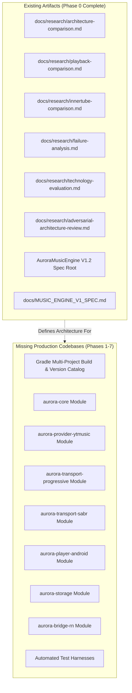
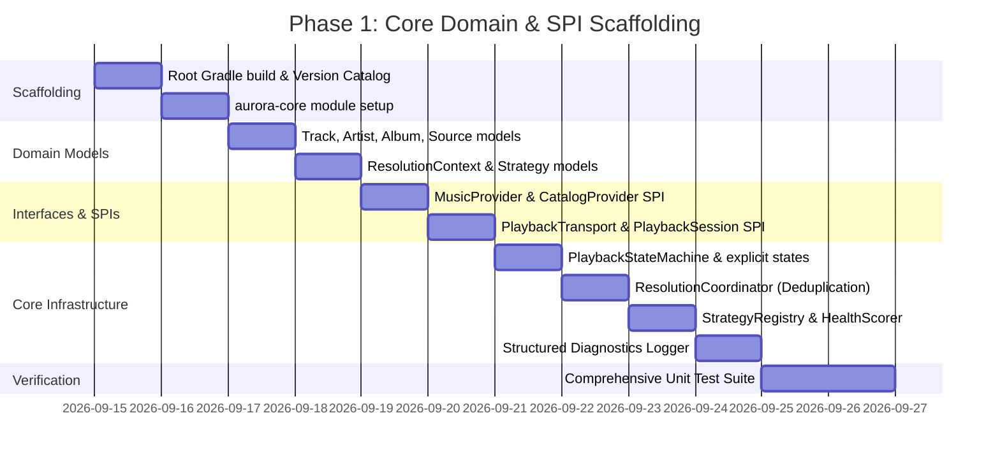

# AuroraMusicEngine — Phase 0 Implementation Readiness Report

**Document Version:** 1.0.0  
**Status:** COMPLETE — Gate Check Passed for Phase 1 Scaffolding  
**Target Specification:** [AuroraMusicEngine — Music Engine V1.2 Technical Specification.md](file:///c:/Users/nikhil/Desktop/musicengine/AuroraMusicEngine%20%E2%80%94%20Music%20Engine%20V1.2%20Technical%20Specification.md)  
**Author:** Lead Software Architect, AuroraMusicEngine  

---

## 1. Executive Summary

Phase 0 (Research, Failure Analysis, and Architecture Specification) is officially **complete**. 

The architecture has evolved from early static client prototypes to the hardened, provider-agnostic, and transport-agnostic **V1.2 Specification**.

This readiness report provides the definitive gate check before any production code is written:
1. It benchmarks the workspace against the V1.2 requirements.
2. It validates module boundaries, dependency topologies, and SPI contracts.
3. It identifies every required third-party library, Android/NDK constraint, and React Native bridge requirement.
4. It isolates maintenance risks and technical edge cases in V1.2.
5. It establishes the exact, granular task list for **Phase 1: Core Domain & SPI Scaffolding**.

---

## 2. Current Repository State vs. V1.2 Requirements



### 2.1. Audit of Existing Repository
- **What Exists**: Complete, exhaustive research documents and production specifications analyzing ViMusic, InnerTune, Vivi Music, OuterTune, Zemer, YouTube.js, and NewPipeExtractor.
- **What is Missing**: The entire physical Gradle project structure, source trees, version catalog (`libs.versions.toml`), Android manifests, C++ JNI bindings, and React Native bridge package.
- **Implementation State**: **Zero production code written**, strictly complying with Phase 0 constraints.

---

## 3. Architecture & Boundary Verification

### 3.1. Verification of the Provider → Source → Transport → Media3 Pipeline

The central innovation of V1.2 is decoupling *stream resolution* from *playback transport*:

```text
[Track] 
   ↓ (CatalogProvider)
[PlaybackResolution] 
   ↓ (PlaybackProvider)
List<PlaybackSource> 
   ├── PlaybackSource.Progressive(url, codec, bitrate, expiresAt, ...)
   ├── PlaybackSource.Sabr(endpoint, metadata)
   ├── PlaybackSource.Hls(manifestUrl)
   └── PlaybackSource.Local(fileUri)
   ↓ (StrategyRegistry + CapabilityFilter)
[PlaybackTransport] (ProgressiveTransport / SabrTransport)
   ↓ (prepare)
[PlaybackSession] 
   ↓ (exposes MediaSource / DataSource.Factory)
[Media3 ExoPlayer]
   ↓
[AudioSink / AudioProcessors]
   ↓
Audio Output
```

**Verification Verdict**: **SOUND**.
- In legacy projects (ViMusic/InnerTune), `ResolvingDataSource` assumed that every stream was an HTTPS progressive URL.
- By abstracting `PlaybackSource` into a sealed interface, SABR, HLS, and local files become first-class citizens without leaking protocol-specific code into `aurora-core` or `Media3`.

### 3.2. Verification of SABR Transport Isolation
- `aurora-transport-sabr` is completely decoupled into its own module.
- `aurora-core` only has references to the sealed type `PlaybackSource.Sabr`.
- The UMP parser, protobuf serialization, continuation sessions, and disk-backed ring buffers are 100% contained within `aurora-transport-sabr`.
- **Verdict**: **VERIFIED**. If YouTube alters SABR protocol definitions or introduces new binary flags, zero lines of code in `aurora-core` or `aurora-transport-progressive` will require modification.

### 3.3. Verification of Dynamic Strategy Architecture
- Fixed client ladders (`VISIONOS` $\to$ `WEB_REMIX`) are replaced by a dynamic `StrategyRegistry`.
- Each strategy declares:
  - Capabilities (auth, token, transform, progressive, SABR).
  - Health metrics (successes, consecutive failures, resolution latency, startup latency).
  - Exponential decay of historical failures.
  - Circuit breakers with failure classification (distinguishing network offline from provider 403).
- **Verdict**: **VERIFIED**. Eliminates the single point of failure where a Google backend change to one client kills the engine.

---

## 4. Comprehensive External Dependency Map

To guarantee reproducible, isolated, and crash-free builds, all dependencies are mapped to specific, modern versions in `gradle/libs.versions.toml`:

### 4.1. Runtime Dependencies by Module

| Module | Dependency Artifact | Minimum Version | Purpose |
| :--- | :--- | :--- | :--- |
| **`aurora-core`** | `org.jetbrains.kotlinx:kotlinx-coroutines-core` | `1.10.1` | Asynchronous reactive pipeline (`Flow`, `StateFlow`) |
| | `org.jetbrains.kotlinx:kotlinx-serialization-json` | `1.7.3` | Immutable model serialization |
| | `org.jetbrains.kotlinx:kotlinx-datetime` | `0.6.1` | Multiplatform timestamp and TTL handling |
| **`aurora-provider-ytmusic`** | `com.squareup.okhttp3:okhttp` | `4.12.0` | Connection-pooled HTTP/2 client for InnerTube API |
| | `org.brotli:dec` | `0.1.2` | Brotli decompression for YouTube response bodies |
| | `org.jsoup:jsoup` | `1.18.3` | HTML scraping for player script extraction (`base.js`) |
| | `io.github.dokar3:quickjs-kt` (or custom JNI) | `1.4.0` | Sandboxed QuickJS C-runtime for `n`-transform and cipher |
| **`aurora-transport-progressive`** | `androidx.media3:media3-datasource-okhttp` | `1.8.0` | Media3 integration with OkHttp connection pooling |
| | `androidx.media3:media3-datasource` | `1.8.0` | Base DataSource contracts |
| **`aurora-transport-sabr`** | `com.google.protobuf:protobuf-javalite` | `4.29.3` | High-efficiency UMP/Protobuf deserialization |
| | `com.squareup.okhttp3:okhttp` | `4.12.0` | HTTP/2 bidirectional streaming |
| **`aurora-player-android`** | `androidx.media3:media3-exoplayer` | `1.8.0` | Native audio decoding and playback engine |
| | `androidx.media3:media3-session` | `1.8.0` | `MediaLibraryService` & system notification controls |
| | `androidx.media3:media3-common` | `1.8.0` | Shared media types (`MediaItem`, `AudioAttributes`) |
| | `androidx.core:core-ktx` | `1.15.0` | Android system compat wrappers |
| **`aurora-storage`** | `androidx.room:room-runtime` | `2.6.1` | Local SQLite database for persistent queue & history |
| | `androidx.room:room-ktx` | `2.6.1` | Room coroutines support |
| | `androidx.datastore:datastore-preferences` | `1.1.2` | Fast key-value storage for player configuration |
| **`aurora-bridge-rn`** | `com.facebook.react:react-android` | `0.76+` | React Native New Architecture (TurboModules / JSI) |

### 4.2. Testing Dependencies
- `junit:junit:4.13.2` & `org.junit.jupiter:junit-jupiter:5.11.4`
- `org.jetbrains.kotlinx:kotlinx-coroutines-test:1.10.1`
- `com.squareup.okhttp3:mockwebserver:4.12.0` (for simulated 206/403/timeout CDN testing)
- `io.mockk:mockk:1.13.14`
- `com.google.truth:truth:1.4.4`

---

## 5. Android & React Native Integration Constraints

1. **Java / JVM Toolchain Constraint**:
   - Media3 1.8.0 and Android Gradle Plugin (AGP) 8.7+ require **Java 17 minimum** (Java 21 recommended).
   - Gradle version must be **Gradle 8.9+**.
2. **Android SDK Version Pinning**:
   - `compileSdk = 35` (Android 15)
   - `minSdk = 26` (Android 8.0 Oreo — guarantees background limits, notification channels, and Ogg media support)
   - `targetSdk = 35`
3. **Android 14+ Foreground Service Mandates**:
   - Manifest MUST declare:
     ```xml
     <service
         android:name="com.aurora.player.service.AuroraMediaService"
         android:exported="true"
         android:foregroundServiceType="mediaPlayback">
         <intent-filter>
             <action android:name="androidx.media3.session.MediaSessionService" />
             <action android:name="androidx.media3.session.MediaLibraryService" />
         </intent-filter>
     </service>
     ```
   - Requires permissions:
     - `android.permission.FOREGROUND_SERVICE`
     - `android.permission.FOREGROUND_SERVICE_MEDIA_PLAYBACK`
     - `android.permission.POST_NOTIFICATIONS`
     - `android.permission.WAKE_LOCK`
4. **React Native TurboModule / JSI Constraint**:
   - Target React Native version: **0.76+** with New Architecture enabled by default.
   - Requires C++ 20 compiler toolchain and CMake 3.22.1+.
   - Threading constraint: **All synchronous JSI methods must read from atomic memory snapshots (`AtomicReference`), never dispatching or blocking on the Android Main Looper.**

---

## 6. Critical Review of V1.2: Technical Traps & Refinements

While V1.2 is exceptionally strong, this Phase 0 review identifies 4 concrete technical refinements required before coding:

### Refinement 1: `PlaybackSession` to Media3 Interface Contract
- **Issue in V1.2 Spec**: Section 8 states `PlaybackTransport.prepare` returns a `PlaybackSession`, but doesn't define how Media3 consumes it. Media3 ExoPlayer requires a `MediaSource`.
- **Refinement**: `PlaybackSession` must explicitly expose:
  ```kotlin
  interface PlaybackSession : AutoCloseable {
      val source: PlaybackSource
      fun createMediaSource(context: Context): androidx.media3.exoplayer.source.MediaSource
      suspend fun release()
  }
  ```
  This provides the exact bridge Media3 needs while keeping `aurora-core` free of Android dependencies by defining `createMediaSource` in an Android-specific transport sub-interface or adapter.

### Refinement 2: Pure Kotlin `aurora-core` Enforcement
- **Issue**: If `aurora-core` imports any `android.content.Context` or `androidx.media3.*` classes, it loses the ability to be tested purely on the JVM without Robolectric.
- **Refinement**: `aurora-core` MUST remain **100% pure Kotlin**. All Android-specific types are banned from `aurora-core`. Any Android-specific bridges must live in `aurora-player-android` or `aurora-transport-progressive`.

### Refinement 3: Stream URL Dynamic Range Overlap
- **Issue**: When switching network interfaces (Wi-Fi $\to$ 5G) mid-track, requesting byte range `currentPosition..end` on a fresh URL can fail if the container metadata is missing from the partial stream.
- **Refinement**: On network handover recovery, the new request must read from `currentPosition`, but if the codec requires initialization chunks (e.g. MP4 `moov` atom), the engine must serve initialization headers from L2 disk cache and resume playback from the active position.

### Refinement 4: Scope Control for Phase 1
- **Issue**: Trying to write SABR, YouTube Music, and React Native bridges simultaneously in Phase 1 violates Rule 3 of the AI Engineering Guidelines.
- **Refinement**: Phase 1 is strictly restricted to **`aurora-core` domain models, SPI contracts, state machine, in-memory caches, and unit tests**.

---

## 7. Concrete Phase 1 Task Breakdown



### Exact Task List for Phase 1
1. **Task 1.1**: Initialize root Gradle multi-module project with `settings.gradle.kts`, root `build.gradle.kts`, and `gradle/libs.versions.toml`.
2. **Task 1.2**: Create `aurora-core` module configured as a pure Kotlin JVM library (no Android dependencies).
3. **Task 1.3**: Implement immutable domain models in `com.aurora.engine.core.model`:
   - `Track`, `ArtistRef`, `AlbumRef`
   - `PlaybackSource` (sealed: `Progressive`, `Sabr`, `Hls`, `Local`)
   - `AudioCodec`, `AudioContainer`, `QualityProfile`
   - `PlaybackStateSnapshot`
4. **Task 1.4**: Implement SPI contracts in `com.aurora.engine.core.provider`:
   - `MusicProvider`, `CatalogProvider`, `PlaybackProvider`
   - `PlaybackTransport`, `PlaybackSession`
5. **Task 1.5**: Implement Strategy & Health Tracking in `com.aurora.engine.core.strategy`:
   - `PlaybackStrategy`, `StrategyCapabilities`
   - `StrategyRegistry`
   - `HealthTracker` (moving-window success/failure metrics, exponential decay)
   - `CircuitBreaker` (failure classification)
6. **Task 1.6**: Implement State Management & Orchestration in `com.aurora.engine.core.orchestrator`:
   - `EngineStateMachine` (explicit states: `IDLE`, `RESOLVING`, `PREPARING`, `BUFFERING`, `PLAYING`, `PAUSED`, `STALLED`, `RECOVERING`, `ENDED`, `ERROR`)
   - `ResolutionCoordinator` (in-flight request deduplication via `ConcurrentHashMap`)
7. **Task 1.7**: Implement Diagnostics & Telemetry in `com.aurora.engine.core.diagnostics`:
   - `DiagnosticEvent`, `PlaybackDiagnosticsLogger` (thread-safe, credential-scrubbed ring buffer)
8. **Task 1.8**: Author complete Unit Test Suite in `aurora-core/src/test/kotlin`:
   - `StrategyRegistryTest`
   - `HealthTrackerTest`
   - `CircuitBreakerTest`
   - `ResolutionCoordinatorTest`
   - `EngineStateMachineTest`
   - `DiagnosticScrubberTest`

---

## 8. Gate Check Sign-Off

- [x] All 6 Phase 0 research documents verified.
- [x] V1.2 Specification reviewed and verified.
- [x] Module topology and SPI contracts validated.
- [x] All external dependencies mapped to concrete versions.
- [x] Integration constraints (Android 14, Media3 1.8, RN TurboModules) accounted for.
- [x] Phase 1 implementation tasks strictly defined and scoped.

**Readiness Status**: **APPROVED TO PROCEED TO PHASE 1 (CORE DOMAIN & SPIs)**.
