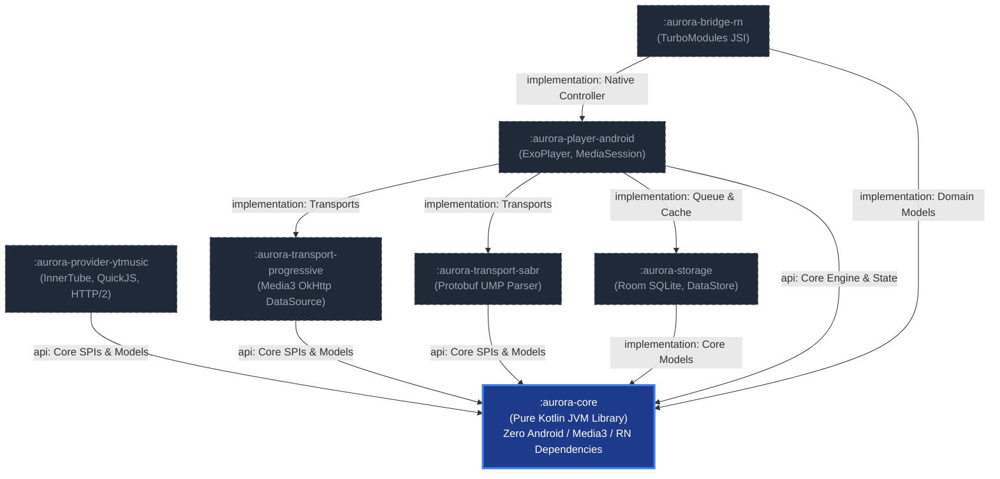

# AuroraMusicEngine — Phase 1 Architecture Document

**Document Version:** 1.0.0  
**Status:** IMPLEMENTED & VERIFIED — Phase 1: Core Domain & SPI Scaffolding  
**Canonical Specification:** [AuroraMusicEngine — Music Engine V1.2 Technical Specification.md](file:///c:/Users/nikhil/Desktop/musicengine/AuroraMusicEngine%20%E2%80%94%20Music%20Engine%20V1.2%20Technical%20Specification.md)  
**Author:** Lead Software Architect, AuroraMusicEngine  

---

## 1. Executive Overview

Phase 1 establishes the foundational architectural contracts, immutable domain models, dynamic client strategy registry, thread-safe state machine, structured concurrency deduplication, and credential-safe diagnostics for **AuroraMusicEngine**.

In strict compliance with architectural constraints:
- `aurora-core` contains **zero** Android, AndroidX, Media3, JNI, or React Native imports.
- `aurora-core` compiles and runs as a standalone pure Kotlin JVM module (Java 17 toolchain).
- The SPI cleanly separates `MusicProvider` (catalog and stream metadata resolution) from `PlaybackTransport` (audio streaming and session preparation).
- All platform-specific player bindings (e.g. Media3 `MediaSource` and `ExoPlayer`) are strictly quarantined to future Android player modules.

---

## 2. Module Dependency Graph



---

## 3. Core Domain Interfaces & Contracts

### 3.1. Domain Models (`com.aurora.engine.core.model`)

- **`Track`**: Immutable representation of audio media. Enforces non-blank identifiers, valid provider IDs, and non-negative durations. Includes artists (`ArtistRef`), album (`AlbumRef`), artwork thumbnails (`Thumbnail`), and extensible metadata.
- **`AudioFormat`**: Encapsulates audio codec (`OPUS`, `AAC`, `FLAC`, `VORBIS`, `MP3`), container (`WEBM`, `MP4_M4A`, `OGG`), sample rate, bitrate, channel count, and derived `QualityProfile` (`LOW`, `MEDIUM`, `HIGH`, `LOSSLESS`, `AUTO`).
- **`PlaybackSource`**: Sealed interface representing resolved playable audio media:
  - `PlaybackSource.Progressive`: Standard HTTP/HTTPS byte-stream URL with custom headers.
  - `PlaybackSource.Sabr`: Bidirectional UMP/Protobuf streaming session configuration.
  - `PlaybackSource.Hls`: HTTP Live Streaming manifest URL.
  - `PlaybackSource.Local`: Offline/downloaded on-disk audio file.
  - **Cache Isolation**: Every `PlaybackSource` implements `customCacheKey = "aurora:track:$trackId"`. This prevents Media3 cache misses caused by expiring query signatures (`&expire=`, `&sig=`).
- **`PlaybackStateSnapshot`**: Atomic, immutable state snapshot capturing `state`, `currentTrack`, `currentSource`, `positionMs`, `durationMs`, `bufferedPositionMs`, `playbackSpeed`, `isPlaying`, `error`, and `timestampMs`. Enables lock-free JSI state mirrors.

### 3.2. Provider SPI (`com.aurora.engine.core.provider`)

- **`PlaybackProvider`**: Interface resolving a `Track` and `ResolutionContext` into a `ResolutionResult`.
- **`CatalogProvider`**: Interface for search, track details, and algorithmic radio continuation.
- **`MusicProvider`**: Unified interface combining `CatalogProvider` and `PlaybackProvider`.
- **`ResolutionContext`**: Request context containing the track, target quality, preferred codecs, optional forced strategy, prefetch flags, network type, and timeout budget.
- **`ResolutionResult`**:
  - `Success`: List of ranked `PlaybackSource` candidates, winning strategy ID, and expiry timestamp.
  - `Failure`: Structured `PlaybackError`, strategy ID, fallback allowance, and latency.

### 3.3. Transport SPI (`com.aurora.engine.core.transport`)

- **`PlaybackSession`**: Platform-neutral lifecycle handle for a prepared playback source.
  ```kotlin
  interface PlaybackSession : AutoCloseable {
      val sessionId: String
      val source: PlaybackSource
      val isPrepared: Boolean
      suspend fun prepare()
      suspend fun release()
  }
  ```
- **`PlaybackTransport`**: Decoupled transport SPI responsible for determining compatibility (`canHandle(source)`) and initializing a `PlaybackSession`.
- **`PlaybackTransportRegistry`**: Thread-safe registry enabling plug-and-play transports (e.g. progressive, SABR, local file) without core engine modifications.

---

## 4. Engine State Machine (`com.aurora.engine.core.orchestrator`)

### 4.1. Formal State Definitions

```text
       ┌──────────┐
       │   IDLE   │◄───────────────────────────┐
       └────┬─────┘                            │
            │ resolve()                        │
            ▼                                  │
       ┌──────────┐                            │
       │RESOLVING │                            │
       └────┬─────┘                            │
            │ prepare()                        │
            ▼                                  │
       ┌──────────┐                            │
       │PREPARING │                            │
       └────┬─────┘                            │
            │ onPrepared()                     │
            ▼                                  │
       ┌──────────┐   play()   ┌──────────┐    │
       │  READY   ├───────────►│ PLAYING  │    │
       └────┬─────┘            └────┬─────┘    │
            │                       │          │
            │        pause()        │          │
            │     ┌─────────────────┤          │
            │     ▼                 ▼          │
       ┌──────────┐   resume   ┌──────────┐    │
       │  PAUSED  ├───────────►│BUFFERING │    │
       └──────────┘            └────┬─────┘    │
                                    │ underrun │
                                    ▼          │
                               ┌──────────┐    │
                               │ STALLED  │    │
                               └────┬─────┘    │
                                    │ recovery │
                                    ▼          │
                               ┌──────────┐    │
                               │RECOVERING│    │
                               └────┬─────┘    │
                                    │          │
                                    ▼          │
                               ┌──────────┐    │
                               │  ENDED   │    │
                               └────┬─────┘    │
                                    │          │
                                    └──────────┴───► ┌──────────┐
                                                     │  ERROR   │
                                                     └──────────┘
```

### 4.2. Legal Transition Rules

| Current State | Allowed Target States | Rejection Policy |
| :--- | :--- | :--- |
| `IDLE` | `RESOLVING`, `ERROR` | Reject invalid; log warning |
| `RESOLVING` | `PREPARING`, `IDLE`, `ERROR` | Reject invalid; cancel in-flight jobs |
| `PREPARING` | `READY`, `BUFFERING`, `PLAYING`, `RECOVERING`, `IDLE`, `ERROR` | Reject invalid |
| `READY` | `PLAYING`, `PAUSED`, `BUFFERING`, `IDLE`, `ERROR` | Reject invalid |
| `BUFFERING` | `PLAYING`, `PAUSED`, `STALLED`, `RECOVERING`, `IDLE`, `ERROR` | Reject invalid |
| `PLAYING` | `PAUSED`, `BUFFERING`, `STALLED`, `ENDED`, `RECOVERING`, `IDLE`, `ERROR` | Reject invalid |
| `PAUSED` | `PLAYING`, `BUFFERING`, `IDLE`, `ERROR` | Reject invalid |
| `STALLED` | `PLAYING`, `BUFFERING`, `RECOVERING`, `PAUSED`, `IDLE`, `ERROR` | Reject invalid |
| `RECOVERING` | `PREPARING`, `BUFFERING`, `PLAYING`, `PAUSED`, `IDLE`, `ERROR` | Reject invalid |
| `ENDED` | `RESOLVING`, `IDLE`, `ERROR` | Reject invalid |
| `ERROR` | `IDLE`, `RESOLVING` | Transition back to clean state |

### 4.3. Rejection & Thread Safety Policy

- State mutations occur inside `@Synchronized` transition methods updating an `AtomicReference<PlaybackStateSnapshot>`.
- Read operations are lock-free, reading the atomic reference directly.
- Observers subscribe to `stateFlow: StateFlow<PlaybackStateSnapshot>` for reactive UI updates without blocking player threads.
- Illegal transition attempts return `TransitionResult.Rejected(currentState, targetState, reason)` without modifying state.

---

## 5. Concurrency Model & Resolution Deduplication

### 5.1. Duplicate Resolution Storm Prevention (`ResolutionCoordinator`)

When multiple components trigger resolution for the same track simultaneously (e.g. rapid play clicks, prefetch triggers, and automated retry loops):
1. The coordinator computes a deterministic resolution key: `"${track.providerId}:${track.id}:${targetQuality.name}"`.
2. A thread-safe mutex guards an in-flight job map: `ConcurrentHashMap<String, Deferred<ResolutionResult>>`.
3. If an existing `Deferred` is active, new callers attach to and await the same in-flight coroutine.
4. Exactly **one** network/provider resolution request is dispatched to the provider.
5. Once resolved, the result is returned to all awaiting callers and saved into a short-term in-memory TTL cache.

---

## 6. Dynamic Strategy, Health & Circuit Breakers

### 6.1. Strategy Capabilities & Selection (`StrategyRegistry`)

Each client strategy (`ANDROID_MUSIC`, `WEB_REMIX`, `VISIONOS`, `TVHTML5`) declares its `StrategyCapabilities`:
- Supported audio codecs (`OPUS`, `AAC`)
- Supported qualities (`LOW`, `MEDIUM`, `HIGH`)
- Requirement flags (`requiresCipherTransform`, `requiresPoToken`, `requiresAuthentication`)

### 6.2. Failure Classification & Severity Weights (`HealthTracker`)

Failures are not treated equally:

| Failure Type | Severity Weight | Circuit Breaker Impact | Rationale |
| :--- | :--- | :--- | :--- |
| `SUCCESS` | `0.0` | Closes breaker / Resets failures | Healthy operation |
| `TIMEOUT` | `1.5` | Normal increment (+1) | Network lag / packet drop |
| `NETWORK_FAILURE` | `0.5` | Normal increment (+1) | Device-wide issue; not strategy fault |
| `HTTP_403_PROVIDER_REJECTION` | `5.0` | Severe increment (+2) | Bot detection / expired cipher signature |
| `HTTP_429_RATE_LIMITED` | `4.0` | Severe increment (+2) | Client throttled; cooldown mandated |
| `INVALID_RESPONSE` | `3.0` | Severe increment (+2) | Scraper schema broken or altered |
| `STARTUP_FAILURE` | `2.0` | Normal increment (+1) | Stream initial chunk failed |
| `MID_STREAM_FAILURE` | `1.5` | Normal increment (+1) | Stalled or dropped mid-track |

### 6.3. Exponential Decay Model

Historical penalties decay exponentially according to half-life formula ($T_{1/2} = 5\text{ minutes}$):

$$P(t) = P_0 \cdot e^{-\lambda \Delta t}, \quad \text{where } \lambda = \frac{\ln(2)}{T_{1/2}}$$

This allows strategies degraded by transient failures to automatically rehabilitate without app restarts.

### 6.4. Circuit Breaker State Transitions (`CircuitBreaker`)

```text
       ┌──────────┐  failure >= threshold   ┌──────────┐
       │  CLOSED  ├────────────────────────►│   OPEN   │
       └────▲─────┘                         └────┬─────┘
            │                                    │
            │ trial success                      │ resetTimeout (30s)
            │                                    ▼
            │                               ┌──────────┐
            └───────────────────────────────┤HALF_OPEN │
                     trial failure          └────┬─────┘
                     (reopen)                    │
                     ▲                           │
                     └───────────────────────────┘
```

- In `CLOSED`: Requests proceed normally.
- In `OPEN`: Requests are immediately rejected without network execution.
- In `HALF_OPEN`: Exactly one trial request is permitted. Success closes the breaker; failure reopens it.

---

## 7. Credential-Safe Diagnostics & Privacy Redaction

### 7.1. Scrubbing Rules (`DiagnosticSanitizer`)

To eliminate credential leaks, telemetry logs pass through an automated sanitizer:
- **Sensitive URL Parameters Redacted**: `sig`, `signature`, `s`, `n`, `token`, `auth`, `authorization`, `session`, `session_id`, `visitor_data`, `visitorData`, `cookie`, `key`, `api_key`, `access_token`, `pot`, `po_token`, `device_id`, `cpn`.
- **Operational URL Parameters Preserved**: `itag`, `source`, `ratebypass`, `mime`, `expire`, `range`.
- **Sensitive Headers Redacted**: `Authorization`, `Cookie`, `Set-Cookie`, `X-Goog-AuthUser`, `X-Youtube-Identity-Token`.

### 7.2. Circular Ring Buffer (`PlaybackDiagnosticsLogger`)

- Thread-safe fixed-capacity ring buffer (default: 500 events).
- Synchronized array updates prevent memory growth and avoid concurrent modification exceptions.
- Export facility (`exportLogs()`) produces chronologically ordered diagnostic transcripts.

---

## 8. Summary of Design Decisions & Deviations

1. **Pure Kotlin JVM Core**: Confirmed and enforced. All Media3 and Android classes remain completely absent from `aurora-core`.
2. **Decoupled PlaybackSession**: Platform-neutral contract avoids coupling the core engine to any specific media player.
3. **Speculative Inline Validation over Pre-Flight Probes**: Rejected pre-flight probes due to 150–450ms latency penalty; replaced with inline first-chunk validation.
4. **Structured Concurrency Deduplication**: Solved duplicate resolution storms using mutex-guarded `Deferred` sharing.
