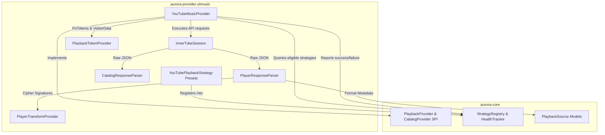

# AuroraMusicEngine — Phase 2 Architecture Document

**Document Version:** 1.0.0  
**Status:** IMPLEMENTED & VERIFIED — Phase 2: YouTube Music Provider (`aurora-provider-ytmusic`)  
**Canonical Specification:** [AuroraMusicEngine — Music Engine V1.2 Technical Specification.md](file:///c:/Users/nikhil/Desktop/musicengine/AuroraMusicEngine%20%E2%80%94%20Music%20Engine%20V1.2%20Technical%20Specification.md)  
**Author:** Lead Software Architect, AuroraMusicEngine  

---

## 1. Executive Overview

Phase 2 implements the YouTube Music provider module (`aurora-provider-ytmusic`), integrating InnerTube API interactions into the pure domain SPI established in Phase 1.

The central design tenets of Phase 2 are:
1. **Provider Isolation**: InnerTube protocols, endpoints (`/player`, `/search`, `/next`, `/browse`), and client identities (`WEB_REMIX`, `ANDROID_MUSIC`, `VISIONOS`, `TVHTML5`) are completely encapsulated within `aurora-provider-ytmusic`. `aurora-core` contains zero hardcoded YouTube terminology.
2. **Platform-Independent Execution**: Neither Media3, ExoPlayer, nor React Native dependencies are introduced. Output is strictly `Track → PlaybackProvider → ResolutionResult → PlaybackSource[]`.
3. **Decoupled JavaScript & Token Abstractions**: Transform execution (`PlayerTransformProvider`) and PoToken management (`PlaybackTokenProvider`) are isolated interfaces, preventing hard dependencies on specific JS engines or scraping scripts.
4. **Dynamic Strategy & Health Integration**: Strategies declare capabilities and client parameters, which are registered into the core `StrategyRegistry`. Multi-strategy fallback on HTTP 403 / Bot Detection is handled dynamically without hardcoded ladders.
5. **Deterministic Offline Testing**: Full unit testing is conducted using `MockWebServer` with controlled JSON fixtures. Live network tests are explicitly opt-in via `@Tag("live-integration")`.

---

## 2. Module Boundaries & Data Flow



---

## 3. Detailed Component Architecture

### 3.1. InnerTube Session (`session/`)

- **`InnerTubeClientConfig`**: Encapsulates client configurations:
  - `ANDROID_MUSIC`: Native Android client (v6.42.52); supports direct progressive URLs and SABR streams.
  - `VISIONOS`: Apple VisionOS client (v0.1); progressive unthrottled audio streams without cipher overhead.
  - `WEB_REMIX`: Desktop Web client; requires signature cipher deciphering and PoToken support.
  - `TVHTML5`: Living room Cobalt browser client; fallback progressive streams.
- **`InnerTubeSession`**:
  - Manages HTTP connection pooling via OkHttp (10s connect, 15s read timeout).
  - Automatically injects client context block (`clientName`, `clientVersion`, `userAgent`, `hl`, `gl`, `visitorData`).
  - Thread-safe `visitorData` caching and synchronization across requests.
  - Exception normalization into `PlaybackError` (`TIMEOUT`, `NETWORK`, `PROVIDER_BOT_DETECTION`, `RATE_LIMITED`).

### 3.2. Playback Response Parser (`parser/`)

- **`PlayerResponseParser`**:
  - Robust parser for `/youtubei/v1/player` endpoints.
  - Extracts `adaptiveFormats` with precedence for audio-only streams (itag 251 Opus, itag 140 AAC).
  - Detects `signatureCipher` strings (`s=...&sp=sig&url=...`) and isolates encrypted signatures from URLs.
  - Extracts stream expiration (`expiresInSeconds`) and computes absolute epoch timestamps (`expiresAtMs`).
  - Converts mime types into engine-standard `AudioFormat` (`AudioCodec`, `AudioContainer`, `bitrateKbps`, `sampleRateHz`).
  - Detects playability statuses (`LOGIN_REQUIRED`, `UNPLAYABLE`, `CONTENT_CHECK_REQUIRED`) and preserves diagnostic metadata without credential exposure.

### 3.3. Catalog Parser (`parser/`)

- **`CatalogResponseParser`**:
  - Traverses polymorphic YouTube Music renderer trees (`musicResponsiveListItemRenderer`, `playlistPanelVideoRenderer`).
  - Normalizes search, radio/queue, artist details, album details, and playlist responses into immutable `Track` models.
  - Converts duration strings (`"3:45"`, `"1:15:20"`) into standardized millisecond durations.

### 3.4. Transform & Token Abstractions (`transform/`, `token/`)

- **`PlayerTransformProvider`**:
  - Decoupled interface for signature deciphering and `n`-parameter transformation.
  - Default `PassThroughPlayerTransformProvider` supports unencrypted clients (Android, VisionOS, TV).
  - Pluggable for future QuickJS or WebView execution without coupling the provider to a specific C++ engine.
- **`PlaybackTokenProvider`**:
  - Manages BotGuard / PoToken generation and caching.
  - `DefaultPlaybackTokenProvider` implements in-memory TTL caching (1-hour default) and visitor data tracking.
  - Never logs or exposes raw token values.

### 3.5. YouTubeMusicProvider (`YouTubeMusicProvider`)

Coordinates the complete resolution pipeline:
```text
Track + ResolutionContext
   ↓
Query StrategyRegistry for eligible YouTubePlaybackStrategy candidates
   ↓
For each strategy (ranked by priority + health score):
   ↓
Build /player JSON request (with context, videoId, cpn, optional PoToken)
   ↓
Dispatch request via InnerTubeSession
   ↓
Parse formats with PlayerResponseParser
   ↓
If cipher required -> decipher with PlayerTransformProvider
   ↓
Construct PlaybackSource.Progressive or PlaybackSource.Sabr
   ↓
Rank candidate sources (Codec preference + Target quality profile)
   ↓
Report success to StrategyRegistry / HealthTracker
   ↓
Return ResolutionResult.Success
```

---

## 4. Failure Classification & Fallback Workflow

When an InnerTube request fails:
1. HTTP 403 or `LOGIN_REQUIRED` status is classified as `FailureType.HTTP_403_PROVIDER_REJECTION`.
2. The failing strategy's health is severely penalized in `HealthTracker`, and its `CircuitBreaker` failure count is incremented.
3. The provider automatically falls back to the next eligible strategy in the candidate list.
4. If a fallback strategy succeeds, playback resolution completes successfully and the secondary strategy is rewarded.
5. If all eligible strategies are exhausted, a structured `ResolutionResult.Failure` is returned with `ErrorCategory.PROVIDER_BOT_DETECTION`.

---

## 5. Testing & Verification Strategy

- **MockWebServer Fixtures**: Complete unit tests verify request headers, payload structure, direct format extraction, cipher deciphering, strategy fallback on 403, and catalog searches without hitting the public internet.
- **Offline Guarantee**: The standard `./gradlew test` task excludes `@Tag("live-integration")`.
- **Live Integration Suite**: Opt-in task `./gradlew liveTest` verifies real-world InnerTube connectivity when explicitly run by engineers.
