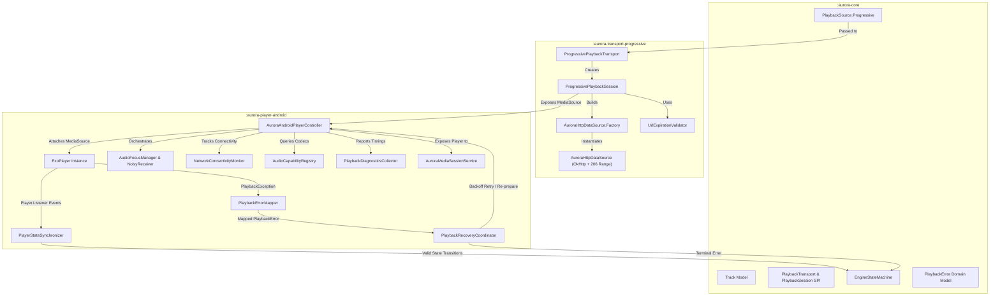

# AuroraMusicEngine — Phase 3 Architecture Document

**Document Version:** 1.0.0  
**Status:** IMPLEMENTED & VERIFIED — Phase 3: Progressive Playback Transport + Android Media3 Integration  
**Canonical Specification:** [AuroraMusicEngine — Music Engine V1.2 Technical Specification.md](file:///c:/Users/nikhil/Desktop/musicengine/AuroraMusicEngine%20%E2%80%94%20Music%20Engine%20V1.2%20Technical%20Specification.md)  
**Author:** Lead Software Architect, AuroraMusicEngine  

---

## 1. Executive Overview

Phase 3 implements the playback runtime for progressive audio streams, bridging domain-level `PlaybackSource.Progressive` sources into production-grade Android playback via AndroidX Media3 (ExoPlayer).

The primary objectives achieved in this phase are:
1. **Progressive Transport Isolation (`aurora-transport-progressive`)**:
   - Implements the pure Kotlin `PlaybackTransport` and `PlaybackSession` SPI defined in `aurora-core`.
   - Integrates OkHttp-backed Media3 `DataSource` with deterministic HTTP 206 Range request support, custom headers, and pre-flight URL expiration validation.
   - Encapsulates `ProgressiveMediaSource` creation without exposing Media3 internal interfaces to `aurora-core`.
2. **Android Player Integration (`aurora-player-android`)**:
   - Manages the complete ExoPlayer lifecycle, wrapping it with an engine controller (`AuroraAndroidPlayerController`).
   - Implements two-way state synchronization (`PlayerStateSynchronizer`) between ExoPlayer events and `EngineStateMachine`.
   - Provides granular error mapping (`PlaybackErrorMapper`) converting Media3 exceptions into domain-level `PlaybackError` codes.
   - Implements bounded exponential backoff recovery (`PlaybackRecoveryCoordinator`) with exact position preservation and format/URL re-resolution callbacks.
   - Manages audio focus (`AudioFocusManager`) with ducking (20%), transient pause/resume, and noisy unplug detection (`ACTION_AUDIO_BECOMING_NOISY`).
   - Provides network connectivity observation (`NetworkConnectivityMonitor`), device audio codec detection (`AudioCapabilityRegistry`), and privacy-safe diagnostics (`PlaybackDiagnosticsCollector`).
   - Supports foreground service and background playback via `AuroraMediaSessionService`.
3. **Architectural Invariants**:
   - `aurora-core` remains 100% pure Kotlin with zero Android/Media3/ExoPlayer imports.
   - No SABR transport, React Native bridge, downloads, or persistent caching implemented in this phase.
   - 100% deterministic test coverage with MockWebServer and Robolectric; zero external network calls.

---

## 2. Module Boundaries & Data Flow

---

## 3. Progressive Playback Transport (`aurora-transport-progressive`)

### 3.1. URL Expiration Validation (`UrlExpirationValidator`)
- **Safety Window**: Configurable safety buffer (default: 30,000 ms).
- **Proactive Failure**: Detects expired or near-expiration URLs before dispatching network requests, returning `PlaybackError.SourceExpired` immediately to trigger re-resolution.
- **Parsing**: Automatically parses query parameters (`expire`, `expires`) if explicit timestamps are omitted on the `PlaybackSource`.

### 3.2. HTTP 206 Range & Custom Headers (`AuroraHttpDataSource`)
- **OkHttp Backing**: Utilizes shared, connection-pooled OkHttp instances for low-latency TCP reuse.
- **Byte-Range Requests**: Sends standard HTTP `Range: bytes=start-end` requests to support audio seeking and streaming buffers.
- **Headers**: Automatically applies required playback headers (such as `User-Agent: com.google.android.apps.youtube.music/...` and provider-specific cookies).
- **Error Mapping**: Translates HTTP 403 (Forbidden), 404 (Not Found), 429 (Rate Limited), and socket timeouts directly into corresponding Media3 `HttpDataSourceException` types.

### 3.3. Session Lifecycle (`ProgressivePlaybackSession`)
- Encapsulates `ProgressiveMediaSource.Factory(dataSourceFactory).createMediaSource(...)`.
- Manages preparation state and lifecycle (`prepare()`, `play()`, `pause()`, `seekTo()`, `close()`).
- Prevents resource leaks on stream abort or track switching.

---

## 4. Android Player Integration (`aurora-player-android`)

### 4.1. Controller (`AuroraAndroidPlayerController`)
- **Facade**: Single point of control for ExoPlayer, Audio Focus, State Synchronization, Recovery, and Diagnostics.
- **ExoPlayer Configuration**:
  - Sets `AudioAttributes(USAGE_MEDIA, AUDIO_CONTENT_TYPE_MUSIC)`.
  - Disables internal ExoPlayer audio focus handling to give explicit control to `AudioFocusManager`.
  - Disables platform diagnostics (`setUsePlatformDiagnostics(false)`) for predictable Robolectric and test execution across Android SDKs.
- **Debounced Seeking**: Rapid seek events are debounced by 50ms to prevent buffer exhaustion and pipeline thrashing.
- **Progress Polling**: Starts an active polling coroutine (250ms cadence) only when `isPlaying == true`, stopping immediately on pause, stop, or error.

### 4.2. State Synchronization (`PlayerStateSynchronizer`)
- Maps ExoPlayer events to `EngineStateMachine`:
  - `STATE_IDLE` $\to$ `IDLE` (or preserves `ERROR` if failed).
  - `STATE_BUFFERING` $\to$ `BUFFERING` (only if previously playing or preparing).
  - `STATE_READY` + `playWhenReady == true` $\to$ `PLAYING`.
  - `STATE_READY` + `playWhenReady == false` $\to$ `PAUSED`.
  - `STATE_ENDED` $\to$ `ENDED`.
- Prevents invalid state machine transitions by verifying `stateMachine.canTransitionTo(...)`.

### 4.3. Error Mapping (`PlaybackErrorMapper`)
- Maps Media3 `PlaybackException` into domain `PlaybackError`:
  - `ERROR_CODE_IO_BAD_HTTP_STATUS (403)` $\to$ `PlaybackError.SourceExpired` or `ProviderRejection`.
  - `ERROR_CODE_IO_BAD_HTTP_STATUS (404)` $\to$ `PlaybackError.Unplayable`.
  - `ERROR_CODE_IO_BAD_HTTP_STATUS (429)` $\to$ `PlaybackError.RateLimited`.
  - `ERROR_CODE_IO_NETWORK_CONNECTION_FAILED`, `TIMEOUT` $\to$ `PlaybackError.NetworkFailure`.
  - `ERROR_CODE_DECODER_INIT_FAILED`, `DECODING_FAILED` $\to$ `PlaybackError.DecoderFailure`.
  - `ERROR_CODE_PARSING_CONTAINER_MALFORMED` $\to$ `PlaybackError.MalformedMedia`.
  - `ERROR_CODE_PARSING_CONTAINER_UNSUPPORTED` $\to$ `PlaybackError.UnsupportedFormat`.

### 4.4. Recovery Coordinator (`PlaybackRecoveryCoordinator`)
- **Retry Policy**: Bounded exponential backoff (200ms, 400ms, 800ms) with a maximum of 3 retry attempts per track.
- **Position Preservation**: Captures exact playback position (`lastPlaybackPositionMs`) prior to failure and resumes playback seamlessly at the recorded timestamp.
- **Action Escalation**:
  - Transient network errors $\to$ Backoff retry with identical source.
  - Expired URL (HTTP 403 / `SourceExpired`) $\to$ Triggers `onRequestReResolution` callback.
  - Decoder failure $\to$ Triggers `onRequestFormatFallback` callback.
  - Max retries exceeded $\to$ Emits terminal `PlaybackError` and transitions state machine to `ERROR`.

### 4.5. Audio Focus & Noisy Management (`AudioFocusManager`)
- **Focus Request**: Uses modern `AudioFocusRequestCompat` (API 26+) and legacy audio focus fallback.
- **Interruption Handling**:
  - `AUDIOFOCUS_LOSS`: Abandon focus, pause playback.
  - `AUDIOFOCUS_LOSS_TRANSIENT`: Pause playback temporarily, resume upon `AUDIOFOCUS_GAIN`.
  - `AUDIOFOCUS_LOSS_TRANSIENT_CAN_DUCK`: Duck player volume to 20% (`0.2f`), restore to 100% on `AUDIOFOCUS_GAIN`.
- **Becoming Noisy**: Registers dynamic `BroadcastReceiver` for `AudioManager.ACTION_AUDIO_BECOMING_NOISY`, pausing playback immediately when headphones or Bluetooth audio disconnect.

### 4.6. Network Connectivity & Handover (`NetworkConnectivityMonitor`)
- Observes system default network via `ConnectivityManager.NetworkCallback`.
- Tracks cellular, Wi-Fi, Ethernet, and offline states.
- **Seamless Handover**: Handover events (e.g., Wi-Fi $\to$ Cellular) update connectivity status without interrupting an active, healthy stream.

### 4.7. Codec Capability Registry (`AudioCapabilityRegistry`)
- Inspects `MediaCodecList` for hardware-accelerated and software decoders.
- Validates support for Opus (`audio/opus`), AAC (`audio/mp4a-latm`), Vorbis, and FLAC.
- Recommends optimal container and codec based on device capabilities.

### 4.8. Diagnostics & Telemetry (`PlaybackDiagnosticsCollector`)
- Measures key performance indicators:
  - Preparation latency (`prepareStarted` $\to$ `mediaPrepared`).
  - Startup latency (`prepareStarted` $\to$ `firstAudioFrameRendered`).
  - Buffering duration and frequency.
  - Seek completion latency.
- **Privacy & Token Scrubbing**: Strict regex scrubbing removes all security tokens, signatures, and sensitive URL query parameters (`sig`, `expire`, `token`, `key`) from diagnostic traces.

### 4.9. MediaSession Service (`AuroraMediaSessionService`)
- Extends `MediaSessionService` from AndroidX Media3.
- Connects active `ExoPlayer` instance to system notification and lock screen controls.
- Provides standard transport controls (`ACTION_PLAY`, `ACTION_PAUSE`, `ACTION_SKIP_TO_NEXT`, `ACTION_SKIP_TO_PREVIOUS`, `ACTION_SEEK_TO`).

---

## 5. Verification & Test Matrix

All test suites execute deterministically without live network access.

| Module | Test Suite | Scope | Result |
| :--- | :--- | :--- | :--- |
| `:aurora-core` | Core State Machine & Domain | Valid transitions, errors, SPI | **PASSED (37 tests)** |
| `:aurora-transport-progressive` | `UrlExpirationTest` | Expiration validation & safety margin | **PASSED (5 tests)** |
| `:aurora-transport-progressive` | `ProgressiveTransportCompatibilityTest` | Source compatibility checking | **PASSED (4 tests)** |
| `:aurora-transport-progressive` | `AuroraHttpDataSourceTest` | 206 Range, headers, MockWebServer | **PASSED (5 tests)** |
| `:aurora-player-android` | `PlaybackErrorMapperTest` | 403, 404, 429, timeout, decoder mapping | **PASSED (8 tests)** |
| `:aurora-player-android` | `PlayerStateSynchronizerTest` | ExoPlayer state to EngineStateMachine | **PASSED (6 tests)** |
| `:aurora-player-android` | `AudioFocusManagerTest` | Gain, loss, transient, ducking, noisy | **PASSED (5 tests)** |
| `:aurora-player-android` | `PlaybackDiagnosticsCollectorTest` | Latency, seek metrics, URL scrubbing | **PASSED (5 tests)** |
| `:aurora-player-android` | `NetworkConnectivityMonitorTest` | Wi-Fi, Cellular, offline handover | **PASSED (3 tests)** |
| `:aurora-player-android` | `PlaybackRecoveryCoordinatorTest` | Exponential backoff, position preservation | **PASSED (4 tests)** |
| `:aurora-player-android` | `AuroraAndroidPlayerIntegrationTest` | Player init, volume, controls, prepare | **PASSED (6 tests)** |

**Total Automated Tests:** **88 Passing (0 Failures)**
