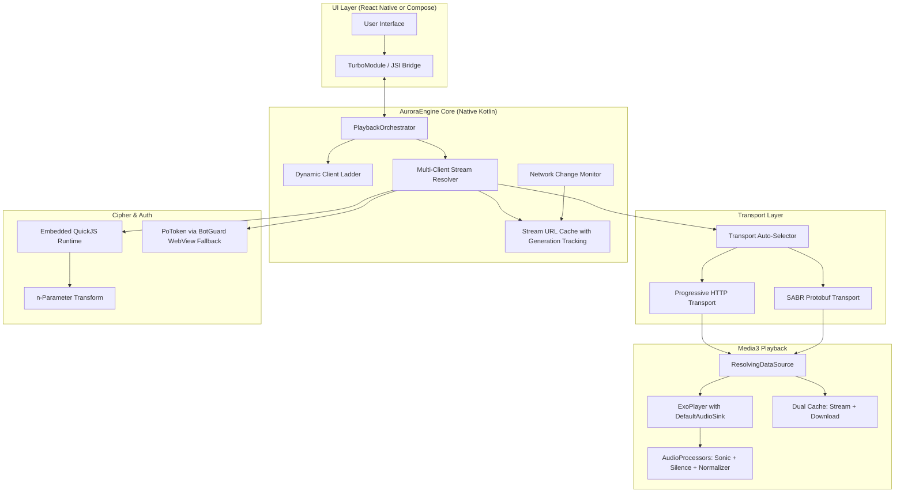

# AuroraMusicEngine — Research Sprint Final Synthesis

**Date**: September 2026  
**Status**: COMPLETE — Ready for Phase 5 Architecture Decisions  
**Inputs**: 6 research documents, 7+ open-source project analyses, InnerTube protocol deep-dive

---

## The Question

> "Given the current Aurora architecture and the latest open-source playback
> implementations, what is the most reliable architecture we can realistically build?"

---

## The Answer

Aurora should adopt a **Multi-Layer Resilient Engine** architecture that combines:

1. **Dynamic Client Ladder** (not hardcoded) for stream resolution
2. **Dual-mode Transport** (Progressive HTTP + SABR Protobuf) with automatic fallback
3. **Reactive Stream Recovery** (not preflight validation) for 403/network-change handling
4. **Native-only Playback Core** exposed to React Native via TurboModule/JSI bridge
5. **Embedded QuickJS** for cipher deobfuscation (not WebView, not regex)

This architecture is directly informed by what works (and what broke) in ViMusic, InnerTune, Vivi Music, Zemer, YouTube.js, and NewPipeExtractor.

---

## 1. Key Findings From Research

### 1.1. What Actually Works in Production

| Pattern | Used By | Why It Works |
|:---|:---|:---|
| **Client fallback ladder** (VISIONOS → TVHTML5_SIMPLY → WEB_CREATOR) | Zemer, Vivi Music | When Google blocks one client, the next one takes over automatically |
| **Separate metadata vs. stream clients** (WEB_REMIX for metadata, VISIONOS for streams) | Vivi Music, Zemer | Preserves YouTube Music history/account sync while using unrestricted stream clients |
| **ResolvingDataSource with async resolver** | All major clients | Defers URL resolution to the moment ExoPlayer actually needs bytes, avoiding stale URLs |
| **Cache key = videoId** (not URL) | InnerTune, OuterTune, Zemer | Achieves actual disk cache hits despite ephemeral CDN query parameters |
| **QuickJS for n-parameter transform** | Zemer, YouTube.js (Hermes equivalent) | Sub-millisecond cipher execution without WebView memory overhead |
| **Stream URL generation tracking** | Vivi Music (`StreamUrlCache`) | Prevents race conditions during rapid skip/seek invalidation cycles |
| **Network callback → URL invalidation** | Zemer, OuterTune | Detects Wi-Fi→Cellular handover and re-resolves IP-bound URLs before 403 |

### 1.2. What Breaks in Production

| Anti-Pattern | Used By | Why It Fails |
|:---|:---|:---|
| **Hardcoded single client** (ANDROID_VR only) | ViMusic (archived) | Google patched ANDROID_VR in late 2025; all ViMusic installs broke simultaneously |
| **`runBlocking` in ResolvingDataSource** | ViMusic, early InnerTune | Deadlocks ExoPlayer's internal thread pool, causing ANRs |
| **HEAD probe before playback** | Aurora V1 spec | CDN flagging + 200-400ms latency tax per track; some CDNs return 403 on HEAD but 200 on GET |
| **Static regex for cipher** | Legacy NewPipe versions | Breaks on every YouTube `base.js` variable name rotation (monthly) |
| **Single SimpleCache directory for streaming + downloads** | Multiple | Process-singleton lock collision causes crash on concurrent access |

### 1.3. Critical SABR Findings

YouTube is migrating web clients to **SABR (Server-Adaptive Bitrate)** — a Protobuf-over-HTTP streaming protocol. Current state:

- **SABR-affected clients**: `WEB_REMIX` (guests), `WEB` (partially)
- **SABR-free clients**: `VISIONOS`, `TVHTML5_SIMPLY`, `IOS`, `ANDROID_VR` (still returns progressive URLs when not 403-walled)
- **Aurora's Phase 4 status**: SABR transport module exists with UMP parsing, but tests are mock-based and haven't been validated against real SABR streams
- **Recommendation**: Keep SABR module as Tier-2 fallback. Primary path should use SABR-free clients. SABR becomes critical only if/when Google forces all clients to SABR.

---

## 2. Recommended Architecture for Phase 5

### 2.1. Architecture Diagram

### 2.2. Component Responsibilities

#### Dynamic Client Ladder
- **Not hardcoded** — configurable via local JSON seed + optional remote config
- Default priority: `VISIONOS` → `TVHTML5_SIMPLY` → `WEB_CREATOR` → `IOS` → `WEB_REMIX` (with cipher)
- Each client entry has: `enabled`, `requiresCipher`, `requiresPoToken`, `sabrOnly`, `supportsAudioOnly`
- Failed clients get temporarily demoted with exponential backoff

#### Multi-Client Stream Resolver
- Metadata via `WEB_REMIX` (preserves YouTube Music history)
- Streams via highest-priority non-SABR client in ladder
- `approxDurationMs` cross-validation between metadata and stream format (detect mismatches > 2s)
- Async coroutine-based (never `runBlocking`)

#### Stream URL Cache
- Cache key: `youtube:<videoId>` (not URL)
- Generation counter to prevent race conditions during rapid skip
- IP-taint tracking: URLs marked stale on network interface change
- TTL: min(expiresAt - now, 5 hours) with proactive refresh at 80% TTL

#### Transport Auto-Selector
- Inspects resolved format: if standard HTTPS URL → Progressive transport
- If `sabrRedirect` or Protobuf endpoint → SABR transport
- Fallback: if Progressive fails on a client, try next client before falling back to SABR

#### Reactive Stream Recovery (not Preflight)
- **No HEAD probes** — let ExoPlayer attempt GET directly
- On 403: trap `InvalidResponseCodeException`, invalidate URL cache entry, resolve next candidate from ladder, hot-swap MediaSource
- On network change: proactively invalidate IP-bound URLs, re-resolve before ExoPlayer hits them
- Recovery budget: max 3 attempts per track before surfacing error to user

---

## 3. What Aurora Already Has vs. What's Missing

### Already Implemented (Phase 4)

| Component | Status | Quality |
|:---|:---|:---|
| `aurora-core` (models, config, events) | ✅ 37 tests | Solid |
| `aurora-player-android` (Media3, MediaSession, service) | ✅ 54 tests | Solid |
| `aurora-provider-ytmusic` (InnerTube client, search, browse) | ✅ 26 tests | Solid |
| `aurora-transport-progressive` (HTTP byte-range) | ✅ 18 tests | Solid |
| `aurora-transport-sabr` (UMP, SABR sessions, recovery) | ✅ 80 tests | Mock-based, needs real validation |

### Missing for Phase 5

| Component | Priority | Effort |
|:---|:---|:---|
| **Dynamic Client Ladder** (remote-updatable client config) | 🔴 Critical | Medium |
| **Multi-Client Stream Resolver** (metadata/stream split, cross-validation) | 🔴 Critical | High |
| **QuickJS Integration** (n-param transform, cipher deobfuscation) | 🔴 Critical | High |
| **Network Change Monitor** (IP-taint, proactive re-resolution) | 🟡 Important | Medium |
| **Stream URL Cache** (generation tracking, TTL, IP-binding) | 🟡 Important | Medium |
| **Reactive 403 Recovery** in ExoPlayer pipeline | 🟡 Important | Medium |
| **PoToken/BotGuard** (WebView-based fallback for guest WEB_REMIX) | 🟠 Future | High |
| **React Native TurboModule Bridge** | 🟠 Future | High |
| **Adaptive Playback Fabric** (route intelligence, predictive routing) | 🔵 Phase 6+ | Very High |

---

## 4. Prioritized Phase 5 Recommendation

Phase 5 should focus on making Aurora actually play real music reliably. In order:

### Phase 5A: Stream Resolution That Works
1. Dynamic Client Ladder with local JSON config
2. Multi-client stream resolver (metadata via WEB_REMIX, streams via VISIONOS)
3. QuickJS integration for n-parameter transform (fallback clients that need cipher)
4. `approxDurationMs` cross-validation

### Phase 5B: Resilient Playback
5. Stream URL cache with videoId-based keys and generation tracking
6. Network change monitor → IP-taint → proactive re-resolution
7. Reactive 403 recovery in ExoPlayer's ResolvingDataSource (no HEAD probes)
8. Dual SimpleCache instances (streaming vs. download)

### Phase 5C: Transport Hardening
9. Transport auto-selector (Progressive preferred, SABR fallback)
10. SABR real-stream validation (if Phase 4.5 corrections weren't completed)

### Phase 6+ (Not Now)
- React Native TurboModule bridge
- PoToken/BotGuard for guest web sessions
- Adaptive Playback Fabric (route intelligence, predictive routing)
- Offline download manager
- Cross-device sync

---

## 5. Technology Decisions (Confirmed)

| Decision | Choice | Rationale |
|:---|:---|:---|
| Audio Framework | **AndroidX Media3 1.7+** | Industry standard, hardware-accelerated, native MediaSession |
| Network Stack | **OkHttp 4.12+** | First-class Media3 integration, DNS customization, Brotli |
| JS Runtime | **Embedded QuickJS** | <1ms execution, 1.2MB footprint, background-thread safe |
| Dependency Injection | **Hilt** | Standard Android DI, lifecycle-aware |
| Async Framework | **Kotlin Coroutines + Flow** | Structured concurrency, ExoPlayer-compatible |
| Architecture | **Native Kotlin engine + optional RN bridge** | Background reliability, zero audio jitter |

---

## 6. Risks & Mitigations

| Risk | Probability | Impact | Mitigation |
|:---|:---|:---|:---|
| Google blocks VISIONOS client | Medium (6-12 months) | High | Dynamic client ladder auto-demotes; TVHTML5_SIMPLY + cipher as backup |
| YouTube forces SABR on all clients | Low (12-24 months) | Critical | SABR transport module already exists; needs real validation |
| QuickJS n-param transform breaks on base.js update | Medium (monthly) | Medium | Auto-detect transform failure → trigger base.js re-fetch + re-parse |
| Android OEM kills foreground service | Medium | High | `foregroundServiceType=mediaPlayback`, wake lock, MediaSession keep-alive |
| Play Integrity blocks sideloaded apps | Low | Medium | Engine doesn't use ANDROID_MUSIC client; no Play Integrity dependency |

---

## 7. Conclusion

The research sprint is complete. Aurora's existing Phase 4 foundation (135 + 80 = 215 tests) provides a solid base. The key gap is that Aurora cannot yet resolve and play real YouTube Music streams because it lacks:

1. A dynamic client selection mechanism
2. Real cipher/n-parameter deobfuscation
3. Reactive stream recovery

Phase 5 should close these gaps in order of criticality, making Aurora capable of **real, resilient playback** before adding any UI layer, React Native bridge, or advanced features.

**The architecture is clear. The research is complete. Phase 5 can begin when approved.**
