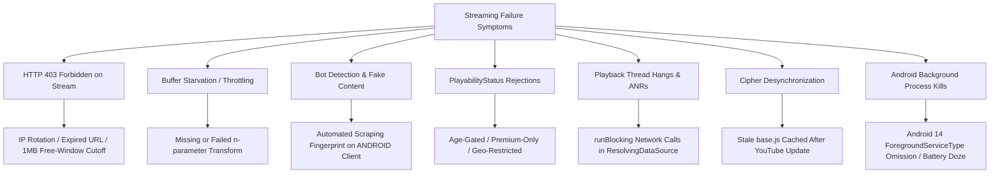

# Production Failure Analysis & Resilience Engineering

This document analyzes the critical real-world failure modes encountered by open-source music streaming applications (**ViMusic**, **InnerTune**, **Vivi Music**, **Zemer**, and **NewPipe**) and establishes the engineering countermeasures required for **AuroraMusicEngine**.

---

## 1. Root-Cause Taxonomy of Streaming Failures

---

## 2. In-Depth Failure Mode Catalog

### 2.1. Failure Mode 1: HTTP 403 Forbidden on Media GET
- **Symptom**: ExoPlayer throws `HttpDataSource$InvalidResponseCodeException: Response code: 403`. Audio abruptly stops mid-track or fails to start.
- **Contributing Factors**:
  1. **URL Expiration**: Every Google Video CDN URL contains an `&expire=<timestamp>` parameter (typically 6 hours from resolution). Playing a paused track after the TTL expires triggers a 403.
  2. **IP-Binding**: YouTube CDN URLs are frequently tied to the client IP address that initiated the `/player` request. If the device switches networks (e.g., Wi-Fi drops and cellular LTE connects), subsequent byte-range requests from the new IP return 403.
  3. **The 1 MiB Free-Window Cutoff**: On certain clients (e.g. `IOS`, unauthenticated `WEB`), YouTube permits fetching the first ~1 MiB of media unhindered. Once playback passes byte offset `1,048,576`, the CDN abruptly cuts the connection with HTTP 403 unless a valid PoToken or signature was verified.
- **Root Cause**: The streaming URL was treated as static immutable state rather than an ephemeral, network-context-sensitive capability token.
- **Aurora Countermeasure**:
  - Implement **Reactive Stream Recovery**: If ExoPlayer encounters an `InvalidResponseCodeException (403)` on an unbuffered range, the engine traps the error, invalidates the L1 URL cache entry, resolves a fresh candidate from the client ladder, and dynamically updates the MediaSource without resetting user queue position.

---

### 2.2. Failure Mode 2: Audio Stuttering & Buffer Exhaustion (The `n`-Transform Throttling)
- **Symptom**: The song plays smoothly for the first 10 to 15 seconds, then pauses to buffer. Buffering takes 5 to 10 seconds, plays 2 seconds of audio, and stutters continuously.
- **Contributing Factors**: Network bandwidth diagnostics show the device has a 100+ Mbps internet connection, yet ExoPlayer receives media data at exactly ~40–50 kbps.
- **Root Cause**: YouTube's Google Video servers inspect the `n` parameter in the stream query string. If the client fails to execute the obfuscated `n`-transform algorithm extracted from the active YouTube `base.js` player script, YouTube's traffic shapers clamp the TCP socket download rate below real-time audio playback bitrates (128–160 kbps).
- **Aurora Countermeasure**:
  - Implement **Autonomous QuickJS Deobfuscation**: Embed a lightweight, JNI-based QuickJS JavaScript runtime. Prior to submitting stream candidates, execute the active `n`-transform function on all URLs originating from web-based clients.
  - Prioritize zero-transform clients (such as `VISIONOS`) where `n`-throttling is currently bypassed.

---

### 2.3. Failure Mode 3: Bot Detection & Fake Video Injection
- **Symptom**: Instead of the requested song, the audio player plays a track featuring a robot voice stating: *"The following content is not available on this app. Watch on the latest version of YouTube."*
- **Contributing Factors**: Using the `ANDROID` or `ANDROID_MUSIC` InnerTube client contexts without valid Google Play Integrity attestation or visitor data.
- **Root Cause**: Google's anti-bot infrastructure flagged the user's IP or client fingerprint as an unauthorized third-party scraper and substituted the media stream with a bot warning video while returning HTTP 200 and `"status": "OK"`.
- **Aurora Countermeasure**:
  - **Blacklist Toxic Clients**: Completely eliminate `ANDROID` and `ANDROID_MUSIC` from the playback resolution ladder.
  - **Payload Validation**: Inspect the resolved `videoDetails.title` and `lengthSeconds`. If `lengthSeconds < 30` and the target song is expected to be 3+ minutes, reject the candidate immediately and trigger client rotation.

---

### 2.4. Failure Mode 4: Thread Deadlocks & ANRs via `runBlocking`
- **Symptom**: App freezes, Jetpack Compose / React Native UI becomes unresponsive, and Android OS raises an ANR (Application Not Responding) dialog.
- **Contributing Factors**: Resolving streams synchronously on the player thread inside `ResolvingDataSource.Factory`.
- **Root Cause**:
  - ExoPlayer's internal loader thread requests the stream URL via a synchronous lambda.
  - In ViMusic and early InnerTune, developers wrapped asynchronous coroutines with `runBlocking(Dispatchers.IO) { ... }`.
  - If the device experiences high packet loss, DNS stalls, or coroutine contention, the playback thread deadlocks, blocking MediaController callbacks and causing the UI to lock up.
- **Aurora Countermeasure**:
  - **Zero `runBlocking` in the Playback Engine**: The playback pipeline must be 100% asynchronous and reactive.
  - The UI and MediaSession interact exclusively via reactive state flows (`StateFlow`). Tracks are pre-resolved in the background before the player transitions. If an unbuffered track requires resolution, a non-blocking `ResolvingDataSource` returns a lightweight pending pipe or coordinates via asynchronous coroutines with strict bounded timeouts (3000ms max).

---

### 2.5. Failure Mode 5: False-Alarm Rejections on HTTP HEAD Validation
- **Symptom**: The resolver attempts to validate a stream candidate using an HTTP `HEAD` request; the request returns HTTP 403, causing the client to discard a perfectly valid stream.
- **Contributing Factors**: Web-based YouTube streams (specifically `WEB_REMIX` with user credentials) reject HTTP `HEAD` requests with a 403 by design on Google Video edge nodes, but successfully serve HTTP `GET` requests with `Range: bytes=0-` headers.
- **Root Cause**: Applying a naive `HEAD` check across all client URLs without accounting for CDN behavior differences.
- **Aurora Countermeasure**:
  - **Adaptive Range-Check Validation**: Validate stream URLs using a lightweight **HTTP GET with `Range: bytes=0-0` (or `bytes=0-1024`)**.
  - Expect an `HTTP 206 Partial Content` response. If the CDN returns `206`, the stream is verified operable with zero ambiguity.

---

### 2.6. Failure Mode 6: Stale Player Script / Cipher Desynchronization
- **Symptom**: All streaming suddenly fails across all users simultaneously with decipher syntax exceptions.
- **Contributing Factors**: YouTube releases a new weekly build of `base.js` with altered variable names and function signatures.
- **Root Cause**: Hardcoded regexes in the cipher extractor fail to locate the entrypoint function, or the application permanently caches a stale, dead `base.js` bundle.
- **Aurora Countermeasure**:
  - **Self-Healing Cipher Pipeline (Zemer Pattern)**: When stream validation fails on a deciphered candidate, the engine triggers an asynchronous cache invalidation (`CipherDeobfuscator.onStreamRejected()`).
  - It fetches the newest player JS bundle, extracts the fresh decipher mapping, updates the in-memory evaluator, and retries the resolution without requiring an application update or restart.

---

### 2.7. Failure Mode 7: Android Background Process Kills & MediaSession Death
- **Symptom**: Music terminates abruptly 2 to 5 minutes after the user turns off the screen or navigates to another application.
- **Contributing Factors**: Aggressive battery optimization profiles on OEM skins (Samsung OneUI, Xiaomi MIUI/HyperOS, Huawei EMUI).
- **Root Cause**:
  1. The audio service was started as a standard background service rather than a bound Foreground Service with valid media notification.
  2. The service declaration in `AndroidManifest.xml` omitted the required `android:foregroundServiceType="mediaPlayback"` attribute introduced in Android 14.
  3. The service failed to acquire an audio `WakeLock` or `WifiLock` during streaming.
- **Aurora Countermeasure**:
  - Strict compliance with **Android Media3 Service Architecture**:
    - Service extends `MediaLibraryService` or `MediaSessionService`.
    - Declares `foregroundServiceType="mediaPlayback"`.
    - Manages `PowerManager.PARTIAL_WAKE_LOCK` and `WifiManager.WifiLock` scoped strictly to active playback states.
    - Implements proper audio focus management handling transient loss and ducking.
