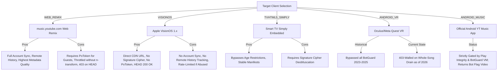

# InnerTube Protocol & Client Implementation Comparison

This document provides a comprehensive technical breakdown of Google's internal **InnerTube API** as analyzed across **ViMusic**, **InnerTune**, **Vivi Music**, **Zemer**, **YouTube.js**, and **NewPipeExtractor**.

---

## 1. What is InnerTube?

InnerTube is Google's consolidated internal JSON/Protobuf API backing all YouTube client surfaces:
- Web (`WEB`, `WEB_REMIX` / music.youtube.com)
- Mobile (`ANDROID`, `ANDROID_MUSIC`, `IOS`, `IPADOS`)
- Living Room & Embedded (`TVHTML5`, `TVHTML5_SIMPLY`, `WEB_EMBEDDED_PLAYER`)
- Specialized Hardware (`ANDROID_VR`, `VISIONOS`)

All clients post JSON payloads to `https://music.youtube.com/youtubei/v1/*` or `https://www.youtube.com/youtubei/v1/*` containing a contextual `context.client` object declaring the client identity, platform version, visitor data, and locale.

---

## 2. InnerTube Endpoint Taxonomy

| Endpoint | HTTP Method | Primary Responsibilities | Key Request Parameters | Typical Response Renderers |
| :--- | :--- | :--- | :--- | :--- |
| `/youtubei/v1/player` | `POST` | Resolves playback streaming data, audio formats, playability status, and track metadata | `videoId`, `playlistId`, `context`, `signatureTimestamp`, `playbackContext` | `streamingData`, `playabilityStatus`, `videoDetails`, `playerConfig` |
| `/youtubei/v1/browse` | `POST` | Catalog navigation, artist discographies, album tracks, home feed carousels, exploration | `browseId` (e.g. `FEmusic_home`, `MPREb_...`, `VL...`), `params`, `continuation` | `sectionListRenderer`, `musicCarouselShelfRenderer`, `musicShelfRenderer` |
| `/youtubei/v1/search` | `POST` | Free-text and filtered music search | `query`, `params` (encoded filter token: Songs, Albums, Artists, Videos) | `musicResponsiveListItemRenderer`, `searchHeaderRenderer` |
| `/youtubei/v1/music/get_search_suggestions` | `POST` | Real-time autocomplete suggestions | `input` | `searchSuggestionsSectionRenderer` |
| `/youtubei/v1/next` | `POST` | Dynamic continuous playback queue, track radios, lyrics browseId, and related metadata | `videoId`, `playlistId`, `playlistSetVideoId`, `isAudioOnly` | `playlistPanelVideoRenderer`, `tabRenderer` (`MusicQueueRenderer`) |
| `/youtubei/v1/music/get_queue` | `POST` | Batch retrieval of full playlist/album item details | `videoIds` (array) | `queueDatas` |

---

## 3. Client Contexts & Streaming Behaviors

Each client profile triggers different enforcement rules, CDN gatekeeping, and format manifests from YouTube backend servers:

### 3.1. Detailed Client Matrix

| Client Name | Client ID / Version | User-Agent Header | Cipher Required? | PoToken Required? | Stream Stability (2026) | Optimal Role in Aurora Engine |
| :--- | :--- | :--- | :--- | :--- | :--- | :--- |
| **`WEB_REMIX`** | `67` / `1.2026...` | Standard Desktop Mozilla/Firefox | Sometimes (`s` or direct) | Yes (Guest sessions) | Moderate (Throttles if `n` ignored) | **Primary Metadata & Scrobble Client** |
| **`VISIONOS`** | `105` / `1.0.2` | `AppleCoreMedia/... (VisionOS)` | **No** (Direct URL) | **No** | **High** (Whole song unthrottled) | **Primary Streaming Fallback #1** |
| **`TVHTML5_SIMPLY`**| `85` / `2.0` | SmartTV HTML5 WebKit | **Yes** (Signature Cipher) | No | **High** (With JS decipher) | **Primary Streaming Fallback #2** |
| **`WEB_CREATOR`**| `62` / `1.0` | Desktop Chrome | **Yes** (Signature Cipher) | Optional | Moderate | **Secondary Fallback** |
| **`ANDROID_VR`** | `28` / `1.65.10` | Android VR/Oculus | No | No | **Deprecating** (403s on drain) | Emergency Fallback Only |
| **`ANDROID_MUSIC`**| `21` / `5.28+` | `com.google.android.apps.youtube.music` | No | Strict BotGuard | **Broken** (Bot video injection) | Do Not Use |

---

## 4. Cryptographic Security & Anti-Bot Mechanisms

### 4.1. Signature Cipher Deobfuscation (`s` / `signatureCipher`)
When YouTube delivers stream objects with a `signatureCipher` field instead of a direct `url`, the client must unscramble the URL signature parameter:
1. The parameter string contains `s=<scrambled_sig>&sp=sig&url=<target_url>`.
2. The deobfuscator fetches the player JavaScript bundle (e.g. `https://www.youtube.com/s/player/<hash>/player_ias.vflset/en_US/base.js`).
3. It parses the JavaScript transformation functions, which consist of three primitive array operations:
   - **Swap**: `function(a, b) { var c = a[0]; a[0] = a[b % a.length]; a[b % a.length] = c; }`
   - **Reverse**: `function(a) { a.reverse(); }`
   - **Splice**: `function(a, b) { a.splice(0, b); }`
4. Executing these operations on the raw `s` string yields the valid deciphered signature, which is appended as `&sig=` to the target URL.

### 4.2. The `n`-Parameter Throttling Defense
To penalize automated scrapers, YouTube injects an `n` query parameter into direct and deciphered streaming URLs (e.g. `&n=mO9xL12_abcd`).
- **The Challenge**: The client must transform `n` into a new computed value using a complex, heavily obfuscated polymorphic JavaScript algorithm inside `base.js`.
- **The Consequence**: If the request omits the transformation and passes the original `n`, the Google Video CDN **throttles the TCP download bandwidth to 40-50 kbps**.
- **Real-World Impact**: In an audio player, a 40 kbps bandwidth limit is lower than the 128 kbps or 160 kbps required for real-time playback, leading to immediate stuttering and buffer exhaustion after the initial 1 MB burst.

### 4.3. Proof-of-Origin Token (PoToken) & Botguard
Introduced extensively across 2024–2026:
- Designed to verify that requests originate from a legitimate browser or certified application environment rather than headless cURL/Python scripts.
- Generated by executing Google's proprietary BotGuard VM script inside an environment supporting DOM/WebView execution.
- Generates two token artifacts:
  1. `visitorData`: Associated with the user's guest session.
  2. `poToken`: A cryptographically signed token bound to the `videoId` and `visitorData`.
- Passed in the `/player` request under `serviceIntegrityDimensions.poToken` and appended to the stream CDN URL as `&pot=<token>`.

---

## 5. Audio Formats & Codec Breakdown

YouTube delivers music through adaptive streams (`adaptiveFormats`):

| itag | Container | Audio Codec | Nominal Bitrate | Sample Rate | Average Audio Quality |
| :--- | :--- | :--- | :--- | :--- | :--- |
| **251** | WebM | **Opus** (`codecs="opus"`) | **160 kbps** | 48.0 kHz | **Highest** (Transparent listening) |
| **140** | MP4 | **AAC-LC** (`codecs="mp4a.40.2"`) | **128 kbps** | 44.1 kHz | **Good** (High compatibility) |
| **250** | WebM | **Opus** | 70 kbps | 48.0 kHz | Medium |
| **139** | MP4 | **AAC-LC** | 48 kbps | 22.05 kHz | Low |
| **249** | WebM | **Opus** | 50 kbps | 48.0 kHz | Low |

### Format Selection Strategy
1. **High Quality Preset**: Prioritize `itag 251` (Opus 160k) if container support and remuxing are enabled; otherwise fallback to `itag 140` (AAC 128k).
2. **Standard Quality Preset**: Select `itag 140` (AAC 128k) or `itag 251`.
3. **Data Saver Preset**: Select `itag 250` (Opus 70k) or `itag 139` (AAC 48k).

---

## 6. InnerTube Implementation Comparison Across Projects

| Project | InnerTube Core | Client Selection Strategy | JavaScript Engine Used | PoToken Handling |
| :--- | :--- | :--- | :--- | :--- |
| **ViMusic** | Custom Ktor module | Fixed `WEB_REMIX` only | None (breaks on cipher) | None |
| **InnerTune** | Forked Ktor module | `ANDROID_VR` -> `WEB_REMIX` | None | None |
| **Vivi Music** | `innertubex` + Custom Ktor | `ANDROID_VR` -> `IOS` -> `WEB_REMIX` | QuickJS + WebView | WebView BotGuard Worker |
| **Zemer** | Optimized Ktor module | **`VISIONOS`** -> `WEB_CREATOR` -> `TVHTML5` | QuickJS | WebView BotGuard Worker |
| **YouTube.js** | Pure TypeScript AST Parser | Fully configurable via options | Node VM / QuickJS / Browser | Embedded `bgUtils` / Native VM |
| **NewPipeExtractor** | Pure Java + NanoJSON | **`VISIONOS`** + `WEB` Metadata | Rhino / QuickJS | Work-in-Progress |

---

## 7. Strategic Conclusions for AuroraMusicEngine

1. **Dual-Client Decoupling**: Do not attempt to use a single InnerTube client for everything.
   - Use `WEB_REMIX` for all browsing, catalog searches, artist/album metadata, radio generation, and remote playback history scrobbling.
   - Use `VISIONOS` as the default Tier-1 streaming resolver, immediately falling back to `WEB_CREATOR` and `TVHTML5_SIMPLY` via a resilient deobfuscation engine.
2. **Embedded JS Evaluation**: AuroraMusicEngine requires an ultra-lightweight embedded JavaScript evaluation runtime (e.g. QuickJS Android C-bindings via JNI) to compute `n`-transforms and signature ciphers without depending on heavyweight Android WebViews.
3. **Provider Extensibility**: Abstract the InnerTube adapter completely behind an engine-agnostic `CatalogProvider` and `StreamResolver` interface.
