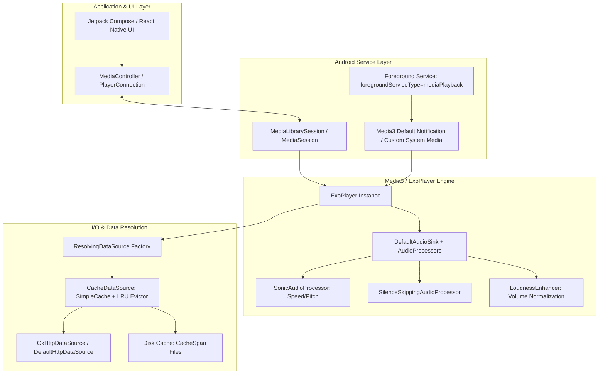

# Audio Playback Architecture Comparison

This document examines the audio playback implementations across open-source Android music players, specifically evaluating **ViMusic**, **InnerTune**, **Vivi Music**, **OuterTune**, and **Zemer**, with a focus on Android Media3 / ExoPlayer integration, audio rendering, background lifecycle, caching, and stream resolution mechanics.

---

## 1. Playback Architecture Overview



---

## 2. Media3 & ExoPlayer Integration Patterns

### 2.1. Versioning & Transition
- **ViMusic**: Originally built on ExoPlayer 2.x, migrated to early AndroidX Media3 (`1.1.x` - `1.3.x`). Uses a hybrid `InvincibleService` wrapper to counteract aggressive Android background process killers.
- **InnerTune**: Media3 `1.4.x`. Implements `MediaLibrarySessionCallback` but retains legacy queue mutations.
- **Vivi Music**: Media3 `1.7.1` with `media3-datasource-okhttp`, `media3-session`, and `media3-hls`.
- **Zemer**: Media3 `1.8.0`. Highest dependency level among evaluated clients, implementing customized `DefaultRenderersFactory` with strict audio offload configs.

### 2.2. Stream Resolution Hook: `ResolvingDataSource` vs. Pre-Resolution

All five Android projects utilize Media3's `ResolvingDataSource.Factory`. However, their execution models differ significantly:

#### Pattern A: The `runBlocking` Trap (ViMusic & Early InnerTune)
```kotlin
// Anti-pattern seen in ViMusic & early InnerTune
ResolvingDataSource.Factory(cacheDataSourceFactory) { dataSpec ->
    val mediaId = dataSpec.key ?: error("Key required")
    if (cache.isCached(mediaId, dataSpec.position, 512 * 1024L)) {
        dataSpec
    } else {
        // BLOCKS the ExoPlayer playback/loader thread!
        val playbackData = runBlocking(Dispatchers.IO) {
            Innertube.player(PlayerBody(videoId = mediaId))
        }.getOrThrow()
        dataSpec.withUri(playbackData.streamUrl.toUri())
    }
}
```
**Fatal Flaw**:
1. When ExoPlayer prepares a new track or seeks into an unbuffered region, the internal loader thread calls the resolver callback synchronously.
2. If InnerTube network requests suffer latency (500ms - 2500ms) or hit TLS handshakes, the ExoPlayer playback thread stalls.
3. If an unhandled exception or network timeout occurs, it crashes the playback worker or triggers `PlaybackException.ERROR_CODE_IO_UNSPECIFIED`, stopping the entire playlist.

#### Pattern B: Pre-Resolution with ResolvingDataSource Fallback (Vivi Music & Zemer)
Vivi Music and Zemer decouple resolution from playback by introducing:
1. **L1 In-Memory URL Cache**: Fast lookups (`mediaId -> CachedStreamUrl(url, headers, clientName, expiry)`).
2. **Next-Track Prefetch Worker**: When track `N` reaches 80% completion (or on playback start), a coroutine resolves track `N+1` in the background and populates the L1 cache.
3. **Optimistic Cache Hit**: When ExoPlayer transitions to track `N+1`, `ResolvingDataSource` hits L1 instantly (0ms latency). Only in cold cache misses does it perform an synchronous fallback.

---

## 3. Audio Pipeline, DSP & Renderers

### 3.1. Audio Sink & Audio Processors
Modern open-source players customize Media3's `DefaultAudioSink` by chaining audio processors:
1. **`SonicAudioProcessor`**: Provides pitch and speed scaling without acoustic distortion.
2. **`SilenceSkippingAudioProcessor`**: Dynamically analyzes PCM amplitudes; trims intro/outro dead air and inter-track pauses.
3. **Volume Normalization / ReplayGain**:
   - ViMusic & InnerTune extract `loudnessDb` from InnerTube's `playerConfig.audioConfig.loudnessDb`.
   - The engine translates `loudnessDb` into a target gain and configures Android's hardware/DSP `LoudnessEnhancer(audioSessionId)`:
     ```kotlin
     val targetGainMb = ((-loudnessDb) * 100).toInt().coerceIn(-1000, 1000)
     loudnessEnhancer.setTargetGain(targetGainMb)
     loudnessEnhancer.enabled = true
     ```

### 3.2. Audio Offload & Battery Optimization
- Most implementations disable `AudioOffload` because combining hardware offload with DSP effects (`LoudnessEnhancer`, equalizer) and `SilenceSkippingAudioProcessor` causes driver crashes or silent audio on Qualcomm and MediaTek chipsets.
- Audio attributes are uniformly set to:
  ```kotlin
  AudioAttributes.Builder()
      .setContentType(C.AUDIO_CONTENT_TYPE_MUSIC)
      .setUsage(C.USAGE_MEDIA)
      .build()
  ```

---

## 4. Cache Architecture & Storage Management

### 4.1. Two-Tier Storage Architecture

| Cache Tier | Scope | Implementation | Eviction Policy | Data Stored |
| :--- | :--- | :--- | :--- | :--- |
| **Tier 1 (L1)** | RAM | Thread-safe `LinkedHashMap` with Generation Counters | TTL (derived from `expire` param) + Max Size (500 entries) | CDN Stream URLs, HTTP Headers, Client Provenance |
| **Tier 2 (L2)** | Flash / Disk | Media3 `SimpleCache` + `StandaloneDatabaseProvider` | `LeastRecentlyUsedCacheEvictor` (configurable 512MB - 10GB) | Encrypted/Raw Audio Chunk Spans (`.v1.exo` or `.uid`) |

### 4.2. Cache Invalidation & Generation Guard
Vivi Music introduces a critical concurrency pattern in `StreamUrlCache.kt`:
- Multiple coroutines and player threads can request or invalidate streams simultaneously.
- If a stream 403s on GET, the cache invalidates the entry and advances an integer `generation(mediaId)`.
- Late-arriving resolution results from stalled background tasks verify `generation == expectedGeneration` before writing. This prevents a slow, expired resolution from overwriting a freshly refreshed URL.

---

## 5. Background Lifecycle & Foreground Service

### 5.1. Android 12, 13 & 14 Enforcements
Modern Android versions enforce severe constraints on audio background services:
1. **Foreground Service Type**: Android 14+ requires `android:foregroundServiceType="mediaPlayback"` declared in `AndroidManifest.xml` and passed to `ServiceCompat.startForeground`.
2. **Notification Permissions**: Android 13+ requires explicit runtime permission `android.permission.POST_NOTIFICATIONS`.
3. **Foreground Service Start Restrictions**: Calling `startForegroundService()` from the background throws `ForegroundServiceStartNotAllowedException`. Projects solve this by starting the service while the app is foregrounded or binding via `MediaBrowser` / `MediaController`.

### 5.2. MediaSession & Android Auto Integration
- Early players (ViMusic) used `PlayerNotificationManager` from the legacy `media2` or ExoPlayer UI package.
- Modern players (InnerTune, Vivi Music, Zemer) utilize `androidx.media3.session.MediaLibrarySession` or `MediaSession.Builder(context, player)`.
- **Benefits**:
  - System automatically constructs the System Media Notification (Notification shade media controls).
  - Native lockscreen seekbar, play/pause, next/prev, and artwork support without custom RemoteViews.
  - Automatic handling of Android Auto / Android Automotive browsing protocols via `MediaLibrarySession.Callback`.

---

## 6. Offline Downloads

| Project | Download Engine | Remuxing Support | Storage Format |
| :--- | :--- | :--- | :--- |
| **ViMusic** | Custom HTTP file download | None | M4A raw |
| **InnerTune** | `media3-exoplayer-workmanager` / `DownloadService` | None | Chunked Media3 cache |
| **Vivi Music** | Media3 `DownloadManager` + direct HTTP range | Optional Opus remuxing | Raw M4A / WebM |
| **Zemer** | Custom `DownloadUtil` + Container Matching | **Full Ogg Remux** (Opus itag 251 wrapped in Ogg container with Vorbis comments) | Ogg / M4A with embedded tags |

### 6.1. The Container Remuxing Breakthrough (Zemer)
YouTube serves Opus audio inside WebM containers (itag 251) and AAC audio inside MP4 containers (itag 140).
- Standard Android audio players and taggers struggle to parse or embed ID3 metadata into WebM containers.
- Zemer extracts Opus packets from WebM and repacks them into an **Ogg container on-device (API 29+)**, injecting Vorbis metadata comments and album art. This yields pristine 160kbps Opus files that are universally recognized across Android media libraries.

---

## 7. Comparative Assessment for AuroraMusicEngine

| Component | Industry Best Practice | Pitfall to Avoid | Recommended Aurora Implementation |
| :--- | :--- | :--- | :--- |
| **Stream Resolution** | Non-blocking background resolver + L1 URL cache | `runBlocking` on playback thread | **Async Pre-Resolution Pipeline** with Reactive StateFlow |
| **Audio Engine** | Media3 `ExoPlayer` 1.8+ | Rolling custom OpenSL ES/Oboe engine | **Media3 ExoPlayer** with custom `DefaultMediaSourceFactory` |
| **Volume Control** | Dynamic DSP `LoudnessEnhancer` from track metadata | Software PCM digital scaling (causes clipping) | **AudioProcessor chain** + Hardware `LoudnessEnhancer` |
| **Queue Management** | Decoupled Reactive Queue Model | Coupling queue state directly to ExoPlayer timeline | **Bidirectional Queue Synchronization** with lookahead window |
| **Cache Reliability** | Generation-tagged LRU + Media3 SimpleCache | Ad-hoc file downloads without byte-range support | **Two-Tier Engine**: In-memory L1 URL + Persistent L2 Chunk Cache |
