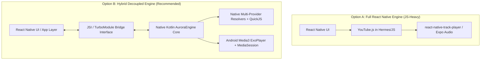

# Technology Stack & Architecture Evaluation

This document evaluates the architectural, framework, and language options for constructing **AuroraMusicEngine**, specifically analyzing trade-offs between Android native components and React Native integrations.

---

## 1. Architectural Distribution: Native Engine vs. React Native Layer

One of the most consequential decisions for AuroraMusicEngine is defining where the boundary between Android Native code and the React Native JavaScript runtime should exist.

### 1.1. The Options Evaluated

### 1.2. Trade-Off Analysis

| Dimension | Option A: Full JS in React Native | Option B: Native Kotlin Engine (Recommended) |
| :--- | :--- | :--- |
| **Background Reliability** | **Poor**: Android aggressively pauses or suspends Hermes/V8 runtimes when the app is in the background or screen is locked. | **Flawless**: Native Android Foreground Service with `MediaLibrarySession` operates independently of JS thread lifecycle. |
| **Audio Latency & Jitter** | **High Risk**: JavaScript garbage collection pauses cause audio glitches and frame drops during complex UI navigation. | **Zero Jitter**: Media3 handles audio decoding and rendering on isolated C++/Java realtime threads. |
| **Stream Recovery Latency** | Slow (requires round-trip over asynchronous JS bridge to resolve and recover). | **Ultra-Fast**: Native engine detects 403 on byte-range GET and recovers seamlessly within milliseconds. |
| **UI Developer Experience** | High for RN developers initially, but painful when debugging native Android lifecycle issues. | Clean, declarative React Native Hooks (`usePlaybackState()`, `useQueue()`) backed by a rock-solid native core. |

**Architectural Verdict**: Build **Option B**. The complete playback engine, network resolvers, stream validation, caching, and MediaSession lifecycle MUST reside entirely in **Native Kotlin**, exposing a typed, bidirectional **TurboModule / JSI Bridge** to React Native.

---

## 2. Audio Framework Selection

| Framework | Maturity | Codec Support | MediaSession Integration | Performance & Battery | Verdict |
| :--- | :--- | :--- | :--- | :--- | :--- |
| **AndroidX Media3 (ExoPlayer)** | **Industry Standard** (Google) | Universal (Opus, AAC, FLAC, MP3, Vorbis, WebM, MP4) | Built-in native `MediaSession` & `MediaLibrarySession` | Hardware-accelerated, efficient memory management | **Selected** (Standard of excellence) |
| **Oboe / OpenSL ES (C++)** | High (Gaming / Pro Audio) | Requires bundling custom FFmpeg decoders | None (Must manually construct MediaSession) | Lowest latency, high complexity | **Rejected** (Unnecessary complexity for streaming playback) |
| **LibVLC** | High | Universal | Basic | High binary footprint (+40 MB APK size) | **Rejected** (Bloat and inflexible architecture) |

---

## 3. Network Stack Selection

| Stack | HTTP/2 & HTTP/3 | DNS Customization | Brotli Support | Media3 Integration | Verdict |
| :--- | :--- | :--- | :--- | :--- | :--- |
| **OkHttp 4.12+** | Yes | Native `Dns` interface (enables `ResilientDns` for IPv4/v6 filtering) | Built-in / interceptor | First-class official `media3-datasource-okhttp` | **Selected** |
| **Ktor Client (CIO/OkHttp)** | Yes | Supported via OkHttp engine | Supported via plugins | Requires custom DataSource bridge | **Secondary** (Used in Kotlin-only modules) |
| **Cronet (Google)** | Yes (QUIC/HTTP3) | Limited custom DNS hooks | Supported | Official `media3-datasource-cronet` | **Alternative** (Higher setup complexity) |

---

## 4. JavaScript Evaluation Runtime for Stream Deciphering

YouTube's `n`-parameter transformation requires evaluating obfuscated JavaScript code derived from YouTube's `base.js`.

| Evaluation Engine | Execution Latency | Memory Footprint | Thread Constraints | Security & Stability | Verdict |
| :--- | :--- | :--- | :--- | :--- | :--- |
| **Embedded QuickJS (via JNI)** | **< 1 ms** | **~1.2 MB** | Can run safely on background coroutines/threads | Isolated sandbox, no DOM attack surface | **Selected** (Peak performance) |
| **Android System WebView** | 200–800 ms | 40–90 MB | Restricted to Main/UI thread; slow initialization | Memory hungry, potential WebKit crashes | **Rejected for Deciphering** (Retained only as fallback for BotGuard PoToken) |
| **Regex Static Translation** | < 0.1 ms | Negligible | Pure CPU | **Extremely Fragile** (Breaks whenever variable names shift) | **Rejected** |

---

## 5. Persistence & Cache Architecture

1. **Media Chunk Storage**:
   - Use Media3's **`SimpleCache`** backed by `StandaloneDatabaseProvider` or `StandaloneSQLiteDatabaseProvider`.
   - Eviction: **`LeastRecentlyUsedCacheEvictor`** capped at a user-configurable limit (default: 2048 MB).
2. **Metadata & Queue Persistence**:
   - Use **Room (SQLite)** for local persistent queue, user favorites, play history, and cached track metadata.
   - Use fast key-value storage (**MMKV** or AndroidX DataStore) for engine configuration, playback positions, and volume gains.

---

## 6. React Native Bridge: TurboModule + JSI

AuroraMusicEngine will expose its API to React Native using the **New Architecture TurboModule (JSI)**:

### 6.1. Why JSI/TurboModules?
- **Synchronous Method Calls**: State checks like `engine.getPlaybackPositionMs()` or `engine.getPlaybackState()` execute synchronously over memory pointers without serialization latency.
- **Strong Typing**: Typed specs generated via Codegen ensure JavaScript and Kotlin remain 100% type-safe.
- **Fast Event Dispatching**: Media events (`onPlaybackStateChanged`, `onProgress`, `onTrackChanged`, `onEngineError`) are dispatched directly onto the React Native JavaScript thread without JSON stringify overhead.
